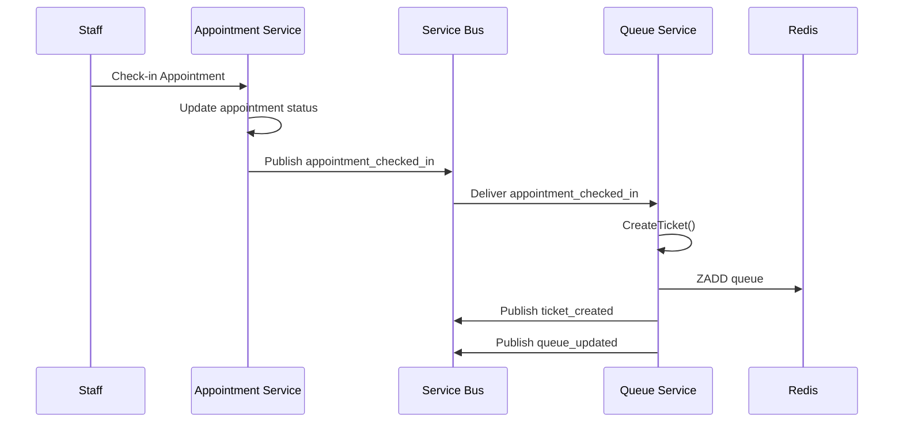
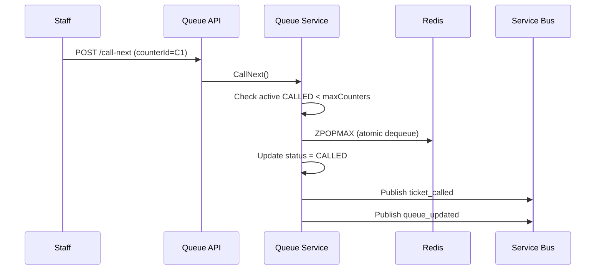

# Queue Management Service

Purpose: Core queue lifecycle and operations.

## Completed Use Cases

- UC-Q1: Create Queue (Admin creates a queue for a location/service type)
- UC-Q3: Generate Ticket / Join Queue (Staff creates ticket for walk-in OR system creates from appointment)
- UC-Q4: Call Next Ticket (Staff advances queue)
- UC-Q6: Real-time Queue Status (Public dashboard reads current serving number + waiting list)

## Incomplete Use Cases

- UC-Q2: Configure Capacity / Service Counters (Admin sets number of counters, operating hours)  
  Currently, admin can only configure queue with number of counters (no operating hours, etc.)

- UC-Q5: Update Ticket Status (Serving, Skipped, Cancelled, Completed)  
  Ticket status can only be updated to complete (no skipped, cancelled, etc.)

## Notes

Currently using a mock in-memory event publisher (API calls) for adding a dummy appointments and performing basic operations.

---

# Installation & Setup

## Prerequisites

- Docker Desktop installed
- .NET 8 SDK (.NET 10 works as well)


## Run Using Docker 

1. Navigate to the project directory:

   ```bash
   cd QueueService
   docker compose up --build
   ```
---

## Open Swagger UI in Browser

http://localhost:5000/swagger

## Quick Test Flow (Swagger)

Create appointment with the provided tenant id and service id. 

1. **Configure Queue**
   - Endpoint: `POST /api/queue/configure`
   - Provide:
     - `tenantId` (GUID)
     - `serviceId` (GUID)
     - `maxCounters` (e.g., 2)

2. **Create Ticket**
   - Endpoint: `POST /api/queue/ticket`
   - Use the same `tenantId` and `serviceId`

3. **Call Next**
   - Endpoint: `POST /api/queue/call-next`
   - Provide:
     - `tenantId`
     - `serviceId`
     - `counterId` (e.g., `C1`)

4. **Complete Ticket**
   - Endpoint: `POST /api/queue/complete`
   - Provide:
     - `queueEntryId` (from ticket creation response)

5. **View Queue Status**
   - Endpoint: `GET /api/queue/status`
   - Returns:
     - `WaitingCount`
     - Currently serving tickets

---

# Flow

## Queue Ticket Creation (UC-Q3)


## Counter Calls Next (UC-Q4)




